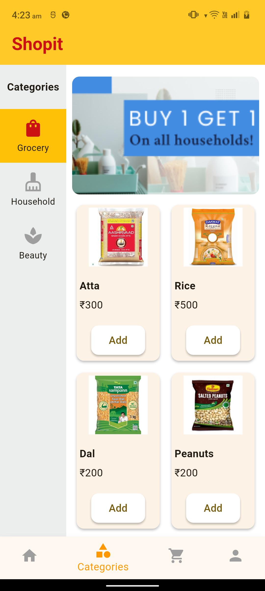
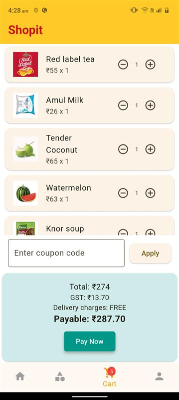
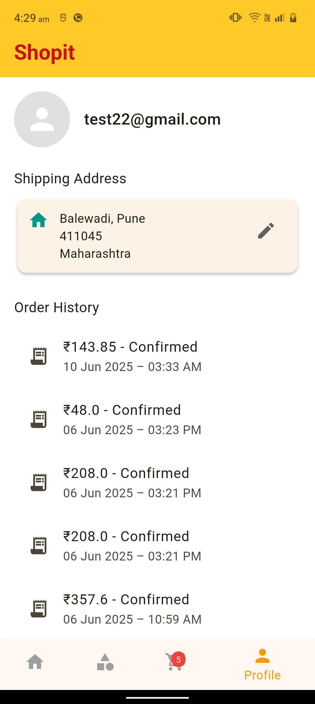

# 🛍️ Shopit – Flutter E-Commerce App

**Shopit** is a fully functional e-commerce mobile application built with **Flutter** and **Firebase**. It allows users to browse products, manage a cart, apply coupons, view order history, and perform secure checkouts — providing a seamless online grocery shopping experience.

---

## 📱 Screenshots

| Home Screen | Categories | Cart | Profile |
|-------------|------------|------|---------|
|  |  |  |  |

---

## 🚀 Features

- 🔐 Firebase Authentication
- 🛒 Add to Cart, Quantity Management
- 🧾 Order History with Time & Status
- 📦 Shipping Address Management
- 💸 Coupon Code Application & GST Calculation
- 🧠 Product Recommendations
- 🔍 Category-wise Product Listing
- ❤️ Wishlist (Firestore synced)
- ☁️ Firebase Firestore as backend
- 📱 Responsive UI with custom design

---

## 🛠️ Tech Stack

- **Flutter** – Frontend
- **Firebase Authentication** – User Management
- **Firebase Firestore** – Realtime Database
- **Firebase Storage** – Product Images
- **Stripe** –  Payment Gateway

---

## 📦 Project Structure

```bash
lib/
├── data/
├── models/
├── provider/
├── screens/
├── services/
├── utility/
├── widgets/
└── main.dart

